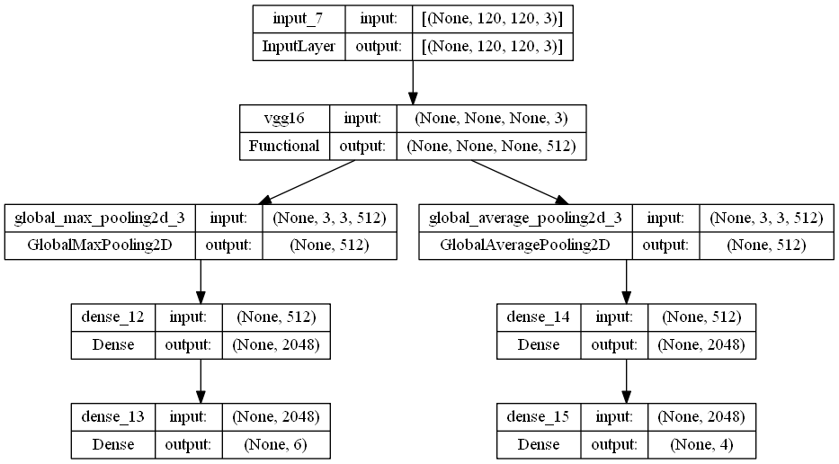

# RealTime-Emotion-Recogition-From-Facial-Expression

## Introduction
This project is about real time emotion recognition from facial expression. The model is trained on Custome dataset. The model is trained on 5 emotions: Angry, Happy, Sad, Surprise, Neutral.

The model is trained on 168 of personal taken images from me and my collagues, the data were annotated through `labelme` and augmented using `Albumentation`

Measuring the accuracy of the model is irrlavent as the model is trained on a very small dataset, all the dataset were created using my labtop camera. although the model is trained on a small dataset, it can still detect the emotion of the person in real time.

## Libraries
- Tensorflow
- OpenCV
- Labelme
- Albumentation
- Tkinter

## Proof of Concept
- Real time Facial Tracking proof of concept

<video width="640" height="480" controls>
  <source src="misc/Tracking.mp4" type="video/mp4">
</video>

- Real time Emotion Recognition proof of concept

<video width="640" height="480" controls>
  <source src="misc/Recognition.mp4" type="video/mp4">
</video>

## Tracked Loss - Modified Yolo v1
I have modified the loss function of Yolo v1 to fit my dataset, to detect and classify one face in the captured image.

$$
CenterLoss = \sum{(X_{True}- X_{Pred} )^2 + (Y_{True} - Y_{Pred})^2 }
$$

$$
BoxLoss = \sum{(W_{True}- W_{Pred} )^2 + (H_{True} - H_{Pred})^2 }
$$

$$
LocalizationLoss = Centerloss + 0.5*BoxLoss
$$

$$
BCELoss = \sum{Y_{True}log(Y_{Pred}) + (1 - Y_{True})log(1 - Y_{Pred})}
$$

$$ 
TotalLoss = 2* LocalizationLoss + BCELoss
$$

## Model Architecture
- VGG16 is used as the backbone of the model, weights are initialized with imagenet weights - `14.7` million parameters.
- two MLPs are used to predict the bounding box and the class of the face in the image - `1.05` million parameters each.
  - Regression part of the model is used to predict the bounding box of the face in the image.
  - Classification part of the model is used to predict the class of the face in the image.

- over all the model has `17.8` million parameters.

## Dataset
- The dataset is created using my labtop camera, 168 images are taken from me and my collagues.
- The dataset is annotated using `labelme` 
- Augmentation was done using `Albumentation` to increase the size of the dataset to 17k images, **Increasing the Dataset is much much Better**.

## Training
- All my training is done on Google Colab, with GPU enabled, 
  - Batch Size: 128
  - Epochs: 500
  - Adam Optimizer with lr = 0.0001
  - Loss Function: Modified Yolo v1 Loss
  - Early Stopping: 25 epochs
- Real time inference is done on my Labtop with GTX 1650, with 20+ FPS.

## Real Time Recognition
- Clone the repo, make sure you have all the required libraries installed.
- Run the `ERApp.py` file, and enjoy the real time emotion recognition.
- you might need retrain the model on your own dataset to get better results.

#TODO : Add notebook for testing the model on colab

## Future Work
- Train the model on a larger dataset.
- Use a better loss for multi-Face recognition.
- Split the model into two models, one for face detection and the other for emotion recognition, while maintaining the real time performance.